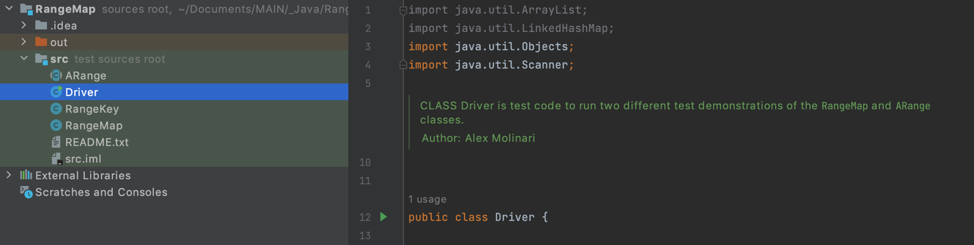
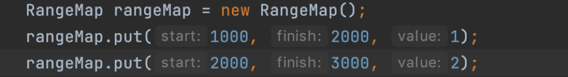
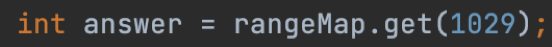

# RangeMap
RangeMap is an extension of Java’s Linked HashMap that takes a range of numeric values as a key to a singular value in system memory. Calling RangeMap.get() for any number within a range-key will produce the corresponding value for that range/value pair.

The RangeMap get() method finds the appropriate key by dividing the input parameter by the
interval of the RangeMap Object's keys, and then passes the Object key to the superclass’s get() method.  This allows any key/value pair, even those that aren’t explicitly initialized, to be searched by reference.

The RangeMap has several use-cases where a range of values needs to point to a singular object or value.  The Object can be a primitive, Object, or another nested range/value pair.  When working with ranges in data, this allows the user to simulate and reference billions of key/value pairs at comparable efficiency to any other HashMap type.  RangeMap can also save system memory for instances where system storage is limited.  If the ranges in a RangeMap instance are in intervals of 1000, the storage size of the collection would be 1000x smaller than an equivalent set of key/value pairs.

Use JDK JavaDoc tool to view doc comments in rendered view

DEMONSTRATION INSTRUCTIONS

1.	create run configuration for 'Driver.java' and run program.

2.	Follow prompts in command line for demonstrations of the RangeMap package.

RANGEMAP CLASS INSTRUCTIONS (not needed for running demo)

1. Create a class and make sure ARange, RangeKey and RangeMap are in the same directory, or imported into your project.
 

2. Instantiate a new RangeMap object and add your range start, range end, and the value or object you want that range of values to point to.
 

3. Use RangeMap.get() to get your value from any number inside the range-key.
 

As per the example in step 2, the rangemap will return a value of 1 since it is the assigned value for any key from 1000 to 2000.

For Help, reference the RangeMap.Java doc comments, which outline every aspect of the Collection in detail.
RANGEMAP CLASS INSTRUCTIONS (not needed for running demo)

1. Create a class and make sure ARange, RangeKey and RangeMap are in same directory, or imported into your project.
 

2. Instantiate a new RangeMap object and add your range start, range end, and the value or object you want that range of numbers to point to.
 

3. Use RangeMap.get() to get your value from any number inside the range-key.
 

As per the example in step 2, the rangemap will return a value of 1 since it is the assigned value for any key from 1000 to 2000.

For Help, reference the RangeMap.Java doc comments, which outline every aspect of the Collection in detail.

